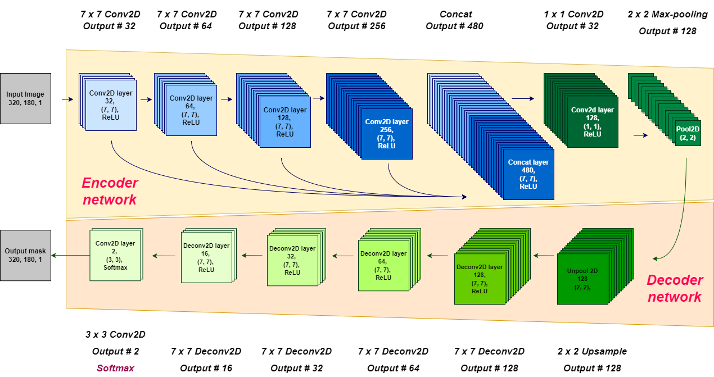
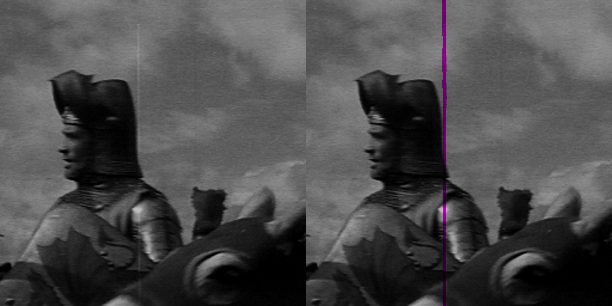
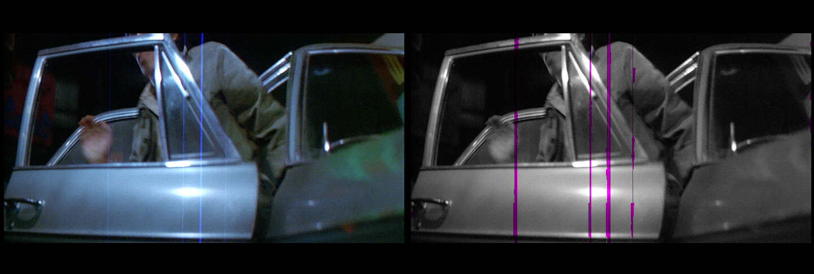

# Automated Movie Restoration

**Trinity College Dublin MAI project** 
-- Prof. Anil Kokaram, Research Xin Shu

## Thesis Reference
This repository contains the source codes for the MAI research project specified below. 
The workflow contains the <em>Aritficial degrade film dataset preparation, 
CNN model training, and prediction post-processing.</em>
```
@techreport{AutomateLineScratchDetection,
    author = {Shu, Xin},
    title = {Automated Film Scratch Detection},
    institution = {Trinity College Dublin},
    year = {2022},
    month = {April},
}
```

## Proposed CNN architecture
With this architecture, 3,428,642 trainable parameters and 1,408 non-trainable parameters are involved.


## Obtained Resutls






## Environment Requirements
The code has been tested with Python 3.6 and TensorFlow 1.15.5 on AMD core device.
```
conda create --name afsd python=3.6
conda activate afsd
conda install numpy, opencv-python
pip install tensorflow-directml
```


